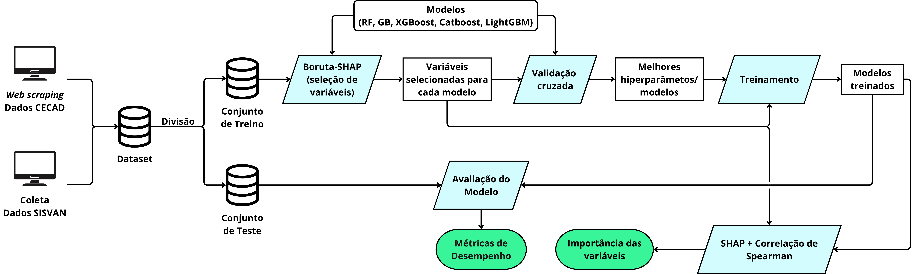
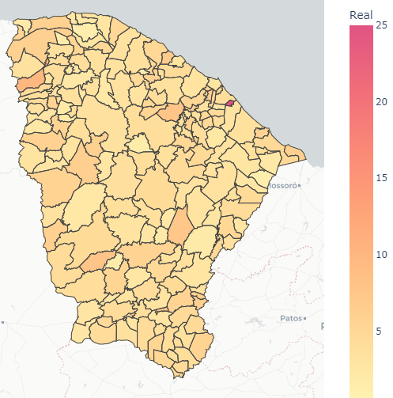
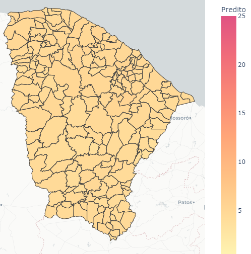
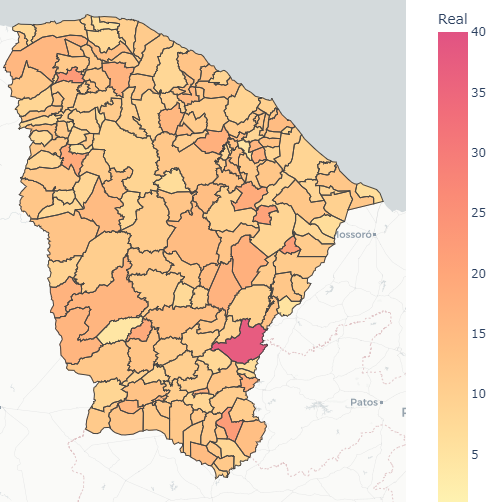
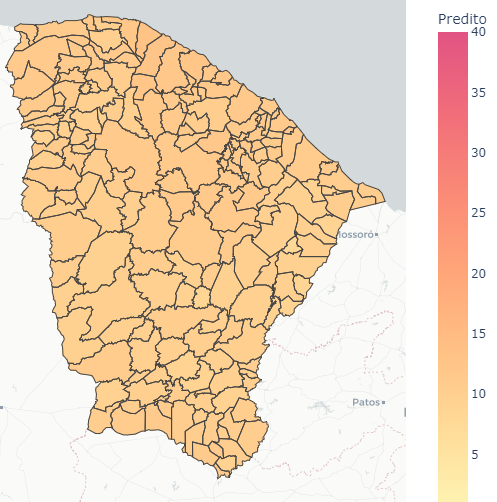
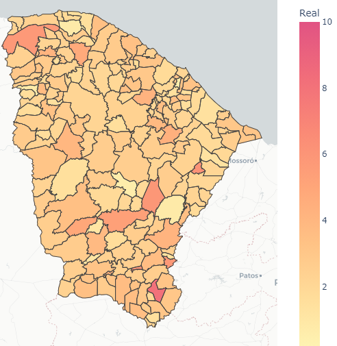
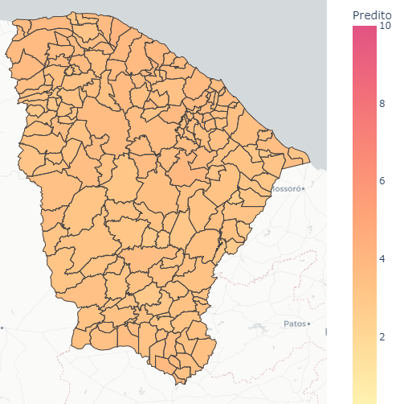

# Análise da fome e insegurança alimentar

## Introdução
Este estudo investiga a grave insegurança alimentar no Brasil, onde, em 2022, mais de 21 milhões de indivíduos enfrentaram a fome, resultante da falta de acesso a alimentos seguros e nutritivos. Essa condição tem um impacto adverso na saúde pública, ocasionando déficits cognitivos e atrasos no desenvolvimento de crianças. Através da aplicação de modelos de machine learning e da análise de dados socioeconômicos (CadÚnico) e de dados antropométricos (SISVAN), a pesquisa apresenta uma metodologia para a estimativa de indicadores de insegurança alimentar, contribuindo para a formulação de políticas públicas eficazes, com a possibilidade estensão das análises para níveis submunicipais, como em bairros e comunidades. Buscamos fornecer uma metodologia que oriente decisões governamentais no enfrentamento da fome.

## Organição dos arquvos
Os dados extraídos do CECAD e SISVAN se encontram no diretório `data`.

O algoritmo de web scraping usado para coletar os dados do CECAD está em `web_scraping/web_scraping_cadunico.ipynb`.

As implementações dos modelos utilizados estão no diretório `Prediction and Analysis Brazil`.  

## Metodologia

   
  <b>Fig. 1: Sumarização das etapas da metodologia proposta</b>

### Obtensão dos dados
Foram extraídos do [SISVAN](https://sisaps.saude.gov.br/sisvan/relatoriopublico/index) indicadores antropométricos para crianças menores de cinco anos, como baixo peso para altura (BPA), baixo peso para a idade (BPI) e baixa altura para a idade (BAI), em termos percentuais por município. Dados socioeconômicos do CadÚnico foram obtidos via web scraping pela plataforma [CECAD](https://cecad.cidadania.gov.br/tab_cad.php).

### Variáveis do banco de dados CECAD

- Estado cadastral da família
   - Sem Registro Civil
   - Cadastrado

- Faixa da renda total da família
   - Até 1 S.M.
   - Entre 1 e 2 S.M.
   - Entre 2 e 3 S.M.
   - Acima de 3 S.M.

- Faixa da renda familiar per capita
   - Pobreza 1 (até R$ 109)
   - Pobreza 2 (de R$ 109 a R$ 218)
   - Baixa Renda
   - Acima de 1

- Forma de coleta
   - Informação migrada como inexistente
   - Sem visita Domiciliar
   - Com visita domiciliar

- Número de meses após a última atualização cadastral
   - até 12 Meses
   - 13 a 18 Meses
   - 19 a 24 Meses
   - 25 a 36 Meses
   - 37 a 48 Meses
   - acima de 48 Meses

- Recebe PBF família
   - Não
   - Sim
   - Não.1
   - Sim.1

- Calçamento em frente ao seu domicílio
   - Total
   - Parcial
   - Não existe

- Situação do domicílio
   - Urbanas
   - Rurais

- Espécie do domicílio
   - Particular Permanente
   - Particular improvisado
   - Coletivo

- Existência de banheiro
    - Sim
    - Não

- Forma de abastecimento de água
    - Rede geral de distribuição
    - Poço ou nascente
    - Cisterna
    - Outra forma

- Forma de coleta do lixo
    - É coletado diretamente
    - É coletado indiretamente
    - É queimado ou enterrado na propriedade
    - É jogado em terreno baldio ou logradouro (rua, avenida, etc.)
    - É jogado em rio ou mar
    - Tem outro destino

- Forma de escoamento sanitário
    - Rede coletora de esgoto ou pluvial
    - Fossa séptica
    - Fossa rudimentar
    - Vala a céu aberto
    - Direto para um rio, lago ou mar
    - Outra forma

- Material predominante nas paredes externas do domicílio
    - Alvenaria
    - Madeira aparelhada
    - Taipa revestida
    - Taipa não revestida
    - Madeira aproveitada
    - Palha
    - Outro Material

- Material predominante no piso do domicílio
    - Terra
    - Cimento
    - Madeira aproveitada
    - Madeira aparelhada
    - Cerâmica, lajota ou pedra
    - Carpete
    - Outro Material

- Água canalizada no domicílio
    - Sim
    - Não

- Tipo de iluminação
    - Elétrica com medidor próprio
    - Elétrica com medidor comunitário
    - Elétrica sem medidor
    - Óleo, querosene ou gás
    - Vela
    - Outra forma

- Família Indígena
    - Sim
    - Não

- Família quilombola
    - Sim
    - Não

- Cor ou raça
    - Branca
    - Preta
    - Amarela
    - Parda
    - Indígena

- Estado cadastral da pessoa
    - Sem Registro Civil
    - Cadastrado
    - Aguardando NIS
    - Validando NIS

- Faixa etária
    - Entre 0 e 4
    - Entre 5 a 6
    - Entre 7 a 15
    - Entre 16 a 17
    - Entre 18 a 24
    - Entre 25 a 34
    - Entre 35 a 39
    - Entre 40 a 44
    - Entre 45 a 49
    - Entre 50 a 54
    - Entre 55 a 59
    - Entre 60 a 64
    - Maior que 65

- Relação de parentesco com o responsável familiar
    - Pessoa Responsável pela Unidade Familiar - RF
    - Cônjuge ou companheiro(a)
    - Filho(a)
    - Enteado(a)
    - Neto(a) ou bisneto(a)
    - Pai ou mãe
    - Sogro(a)
    - Irmão ou irmã
    - Genro ou nora
    - Outro parente
    - Não parente

- Sexo
    - Masculino
    - Feminino

- Pessoa com marcação de trabalho infantil
    - Sim
    - Não

- Recebe ajuda de cuidador especializado
    - Opção não marcada no formulário
    - Opção marcada no formulário

- Recebe ajuda de alguém da família
    - Opção não marcada no formulário
    - Opção marcada no formulário

- Recebe ajuda de instituição
    - Opção não marcada no formulário
    - Opção marcada no formulário

- Não recebe ajuda de terceiros
    - Opção não marcada no formulário
    - Opção marcada no formulário

- Recebe ajuda de outra forma
    - Opção não marcada no formulário
    - Opção marcada no formulário

- Recebe ajuda de vizinho
    - Opção não marcada no formulário
    - Opção marcada no formulário

- Cegueira
    - Opção não marcada no formulário
    - Opção marcada no formulário

- Síndrome de Down
    - Opção não marcada no formulário
    - Opção marcada no formulário

- Deficiência física
    - Opção não marcada no formulário
    - Opção marcada no formulário

- Deficiência mental ou intelectual
    - Opção não marcada no formulário
    - Opção marcada no formulário

- Surdez leve
    - moderada

- Surdez severa
    - profunda

- Transtorno
    - doença mental

- Baixa visão
    - Opção não marcada no formulário
    - Opção marcada no formulário

- Pessoa tem deficiência?
    - Sim
    - Não

- Ano e série do curso que a pessoa frequenta
    - Primeiro(a)
    - Segundo(a)
    - Terceiro(a)
    - Quarto(a)
    - Quinto(a)
    - Sexto(a)
    - Sétimo(a)
    - Oitavo(a)
    - Nono(a)
    - Curso não-seriado

- A pessoa concluiu o curso?
    - Sim
    - Não

- Curso mais elevado que a pessoa frequentou
    - Creche
    - Pré-escola (exceto CA)
    - Classe de Alfabetização - CA
    - Ensino Fundamental 1ª a 4ª séries...
    - Nenhum

- Curso que a pessoa frequenta
    - Creche
    - Pré-escola (exceto CA)
    - Classe de Alfabetização - CA
    - Ensino Fundamental regular (duração 8 anos)
    - Pré-vestibular

- Grau de instrução
    - Sem instrução
    - Fundamental incompleto
    - Fundamental completo
    - Médio incompleto
    - Médio completo
    - Superior incompleto ou mais

- Pessoa frequenta escola
    - Sim, rede pública
    - Sim, rede particular
    - Não, já frequentou
    - Nunca frequentou

- Pessoa sabe ler e escrever
    - Sim
    - Não

- Último ano e série do curso que a pessoa frequentou
    - Primeiro(a)
    - Segundo(a)
    - Terceiro(a)
    - Quarto(a)
    - Quinto(a)
    - Curso não-seriado

- Atividade extrativista
    - Sim
    - Não

- Função principal
    - Trabalhador por conta própria
    - Trabalhador temporário em área rural
    - Empregado sem carteira
    - Empregado com carteira
    - Estagiário
    - Aprendiz

- Pessoa estava afastada na semana passada?
    - Sim
    - Não

- Trabalho remunerado nos últimos 12 meses
    - Sim
    - Não

- Pessoa trabalhou na semana passada?
    - Sim
    - Não

- Grupos Populacionais Tradicionais e Específicos
    - Famlia Cigana
    - Familia Extrativista
    - Familia de Pescadores Artesanais
    - Familia Ribeirinha
    - Nenhuma

- Situação de Rua
    - Não
    - Sim

### Pré-processamento
O conjunto de dados foi dividido em treino e teste, com o estado do Ceará (184 municípios) sendo usado exclusivamente para teste, visando avaliar a generalização do modelo para municípiod de um estado desconhecido. Em seguida, selecionaram-se variáveis relevantes para cada modelo por meio do Boruta-SHAP. Modelos baseados em árvores foram priorizados, devido à sua eficácia em dados tabulares.

### Treinamento e otimização

Modelos de Random Forest (RF), Gradient Boosting (GB), XGBoost, LightGBM e CatBoost foram testados e comparados. Cada modelo foi submetido a uma seleção de hiperparâmetros por busca em grade, avaliada com validação cruzada de 10 folds no conjunto de treinamento, com base na métrica RMSE. A seguir, vê-se a grade de hiperparâmetros

<table>
<caption>Hiperparâmetros testados na busca em grade</caption>
<thead>
<tr class="header">
<th style="text-align: center;"> </th>
<th style="text-align: left;">Hiperparâmetro</th>
<th style="text-align: left;">Valores da busca em grade</th>
</tr>
</thead>
<tbody>
<tr class="odd">
<td rowspan="4" style="text-align: center;">RF</td>
<td style="text-align: left;"><em>max_depth</em></td>
<td style="text-align: left;">5, 8, 10</td>
</tr>
<tr class="even">
<td style="text-align: left;"><em>min_samples_split</em></td>
<td style="text-align: left;">2, 5, 10, 20</td>
</tr>
<tr class="odd">
<td style="text-align: left;"><em>min_samples_leaf</em></td>
<td style="text-align: left;">1, 25, 50, 70</td>
</tr>
<tr class="even">
<td style="text-align: left;"><em>max_features</em></td>
<td style="text-align: left;">log2, 0,25, sqrt, 1,0</td>
</tr>
<tr class="odd">
<td rowspan="4" style="text-align: center;">GB</td>
<td style="text-align: left;"><em>learning_rate</em></td>
<td style="text-align: left;">0.025, 0,05, 0.1, 0,2, 0,3</td>
</tr>
<tr class="even">
<td style="text-align: left;"><em>max_depth</em></td>
<td style="text-align: left;">2, 3, 5, 7, 10</td>
</tr>
<tr class="odd">
<td style="text-align: left;"><em>max_features</em></td>
<td style="text-align: left;">log2, 0,25, sqrt, 1,0</td>
</tr>
<tr class="even">
<td style="text-align: left;"><em>subsample</em></td>
<td style="text-align: left;">0,15, 0,5, 0,75, 1,0</td>
</tr>
<tr class="odd">
<td rowspan="4" style="text-align: center;">XGBoost</td>
<td style="text-align: left;"><em>learning_rate</em></td>
<td style="text-align: left;">0,025, 0,05, 0,1, 0,2, 0,3</td>
</tr>
<tr class="even">
<td style="text-align: left;"><em>max_depth</em></td>
<td style="text-align: left;">2, 3, 5, 7, 10, 100</td>
</tr>
<tr class="odd">
<td style="text-align: left;"><em>colsample_bylevel</em></td>
<td style="text-align: left;">0,25, 1,0</td>
</tr>
<tr class="even">
<td style="text-align: left;"><em>subsample</em></td>
<td style="text-align: left;">0,15, 0,5, 0,75, 1,0</td>
</tr>
<tr class="odd">
<td rowspan="5" style="text-align: center;">LightGBM</td>
<td style="text-align: left;"><em>learning_rate</em></td>
<td style="text-align: left;">0,025, 0,05, 0,1, 0,2, 0,3</td>
</tr>
<tr class="even">
<td style="text-align: left;"><em>num_leaves</em></td>
<td style="text-align: left;">3, 7, 15, 31, 127, 1024</td>
</tr>
<tr class="odd">
<td style="text-align: left;"><em>top_rate</em></td>
<td style="text-align: left;">0,2, 0,4, 0,6, 0,7</td>
</tr>
<tr class="even">
<td style="text-align: left;"><em>other_rate</em></td>
<td style="text-align: left;">0,05, 0,1, 0,3</td>
</tr>
<tr class="odd">
<td style="text-align: left;"><em>feature_fraction_bynode</em></td>
<td style="text-align: left;">log2, 0,25, sqrt, 1,0</td>
</tr>
<tr class="even">
<td rowspan="4" style="text-align: center;">CatBoost</td>
<td style="text-align: left;"><em>learning_rate</em></td>
<td style="text-align: left;">0,025, 0,05, 0,1, 0,2, 0,3</td>
</tr>
<tr class="odd">
<td style="text-align: left;"><em>max_depth</em></td>
<td style="text-align: left;">3, 6, 9</td>
</tr>
<tr class="even">
<td style="text-align: left;"><em>leaf_estimation_iterations</em></td>
<td style="text-align: left;">1, 10</td>
</tr>
<tr class="odd">
<td style="text-align: left;"><em>l2_leaf_reg</em></td>
<td style="text-align: left;">1, 3, 6, 9</td>
</tr>
</tbody>
</table>

O desempenho dos modelos foi dado por

<table>
  <caption>Desempenho dos modelos na validação cruzada </caption>
  <thead>
    <tr>
      <th rowspan="2">Modelo</th>
      <th colspan="2">BPI</th>
      <th colspan="2">BPA</th>
      <th colspan="2">BAI</th>
    </tr>
    <tr>
      <th>RMSE</th><th>Nº var.</th>
      <th>RMSE</th><th>Nº var.</th>
      <th>RMSE</th><th>Nº var.</th>
    </tr>
  </thead>
  <tbody>
    <tr><td>RF</td><td>2,302 ± 0,498</td><td>16</td><td>2,406 ± 0,516</td><td>11</td><td>4,880 ± 0,531</td><td>41</td></tr>
    <tr><td>GB</td><td>2,340 ± 0,486</td><td>20</td><td>2,429 ± 0,534</td><td>13</td><td>4,900 ± 0,526</td><td>22</td></tr>
    <tr><td>XGBoost</td><td>2,304 ± 0,488</td><td>18</td><td>2,405 ± 0,527</td><td>6</td><td>4,875 ± 0,530</td><td>18</td></tr>
    <tr><td>CatBoost</td><td>2,295 ± 0,477</td><td>16</td><td>2,409 ± 0,538</td><td>16</td><td>4,888 ± 0,510</td><td>26</td></tr>
    <tr><td>LightGBM</td><td>2,306 ± 0,482</td><td>8</td><td>2,398 ± 0,502</td><td>5</td><td>4,888 ± 0,525</td><td>24</td></tr>
  </tbody>
</table>

A tabela acima apresenta o RMSE médio e o desvio padrão (após o $\pm$) dos melhores modelos com os melhores hiperparâmetros testados por validação cruzada. Os resultados indicam um desempenho semelhante entre os modelos, com diferenças dentro do desvio padrão. Foi escolhido, portanto, para cada indicador, o modelo que utilizou menos variáveis na validação cruzada. Em outras palavras, escolheu-se o LightGBM para os indicadores BPI e BPA, e o XGBoost para o indicador BAI. Esses modelos foram, então, treinados com todo o conjunto de treinamento, e os resultados no conjunto de teste estão na tabela abaixo, incluindo as métricas MAE e MAPE para melhorar a interpretabilidade.

  <table>
    <caption>Métricas de desempenho no conjunto de teste dos modelos selecionados por validação cruzada</caption>
    <thead>
      <tr>
        <th></th>
        <th>RMSE</th>
        <th>MAE</th>
        <th>MAPE</th>
      </tr>
    </thead>
    <tbody>
      <tr>
        <td>BPI (LigthGBM)</td>
        <td>1,32</td>
        <td>1,1</td>
        <td>0,57</td>
      </tr>
      <tr>
        <td>BPA (LigthGBM)</td>
        <td>2,22</td>
        <td>1,45</td>
        <td>0,43</td>
      </tr>
      <tr>
        <td>BAI (XGBoost)</td>
        <td>3,93</td>
        <td>2,6</td>
        <td>0,22</td>
      </tr>
    </tbody>
  </table>

A Tabela abaixo mostra, em termos percentuais, a importância de cada variável preditiva para o processo de regressão, por meio do SHAP. Além disso, a coluna “Correlação” contém o valor da correlação de Spearman entre cada preditor e variável alvo.

<table>
  <thead>
    <tr>
      <th>Indicador</th>
      <th>Variável</th>
      <th style="text-align:right;">Importância</th>
      <th style="text-align:right;">Correlação</th>
    </tr>
  </thead>
  <tbody>
    <tr>
      <td rowspan="17"><strong>BAI</strong></td>
      <td>Faixa etária / Entre 18 a 24</td><td style="text-align:right;">11,24%</td><td style="text-align:right;">0,418</td>
    </tr>
    <tr><td>Faixa etária / Entre 55 a 59</td><td style="text-align:right;">10,43%</td><td style="text-align:right;">-0,235</td></tr>
    <tr><td>Faixa da renda total da família / Até 1 Salário Mínimo</td><td style="text-align:right;">10,07%</td><td style="text-align:right;">0,42</td></tr>
    <tr><td>Curso que a pessoa frequenta / Ensino Fundamental regular (duração 9 anos)</td><td style="text-align:right;">8,29%</td><td style="text-align:right;">0,23</td></tr>
    <tr><td>Recebe Programa Bolsa Família / Sim</td><td style="text-align:right;">8,28%</td><td style="text-align:right;">0,428</td></tr>
    <tr><td>Cor ou raça / Branca</td><td style="text-align:right;">8,25%</td><td style="text-align:right;">-0,41</td></tr>
    <tr><td>Água canalizada no domicílio / Não</td><td style="text-align:right;">6,79%</td><td style="text-align:right;">0,383</td></tr>
    <tr><td>Faixa etária / Entre 7 a 15</td><td style="text-align:right;">6,65%</td><td style="text-align:right;">0,247</td></tr>
    <tr><td>Material predominante no piso do domicílio / Terra</td><td style="text-align:right;">5,83%</td><td style="text-align:right;">0,374</td></tr>
    <tr><td>Relação de parentesco com o responsável familiar / Pessoa Responsável pela Unidade Familiar - RF</td><td style="text-align:right;">4,23%</td><td style="text-align:right;">0,042</td></tr>
    <tr><td>Faixa etária / Entre 0 e 4</td><td style="text-align:right;">4,03%</td><td style="text-align:right;">0,226</td></tr>
    <tr><td>Relação de parentesco com o responsável familiar / Cônjuge ou companheiro(a)</td><td style="text-align:right;">2,72%</td><td style="text-align:right;">-0,265</td></tr>
    <tr><td>Curso mais elevado que a pessoa frequentou / Ensino Fundamental (duração 9 anos)</td><td style="text-align:right;">2,68%</td><td style="text-align:right;">0,232</td></tr>
    <tr><td>Faixa etária / Entre 35 a 39</td><td style="text-align:right;">2,4%</td><td style="text-align:right;">0</td></tr>
    <tr><td>Função principal / Empregado sem carteira de trabalho assinada</td><td style="text-align:right;">2,26%</td><td style="text-align:right;">-0,16</td></tr>
    <tr><td>Curso mais elevado que a pessoa frequentou / Ensino Médio, 2º grau, Médio 2º ciclo (Científico, Clássico, Técnico, Normal)</td><td style="text-align:right;">2,08%</td><td style="text-align:right;">-0,05</td></tr>
    <tr><td>Curso mais elevado que a pessoa frequentou / Ensino Fundamental EJA - séries iniciais (Supletivo 1ª a 4ª)</td><td style="text-align:right;">1,69%</td><td style="text-align:right;">0,1</td></tr>
    <tr>
      <td rowspan="5"><strong>BPA</strong></td>
      <td>Material predominante nas paredes externas do domicílio / Taipa não revestida</td><td style="text-align:right;">21,5%</td><td style="text-align:right;">0,318</td>
    </tr>
    <tr><td>Cor ou raça / Preta</td><td style="text-align:right;">20,5%</td><td style="text-align:right;">0,126</td></tr>
    <tr><td>Cor ou raça / Parda</td><td style="text-align:right;">19,58%</td><td style="text-align:right;">0,439</td></tr>
    <tr><td>Cor ou raça / Branca</td><td style="text-align:right;">19,33%</td><td style="text-align:right;">-0,457</td></tr>
    <tr><td>Material predominante nas paredes externas do domicílio / Madeira aparelhada</td><td style="text-align:right;">19,08%</td><td style="text-align:right;">-0,165</td></tr>
    <tr>
      <td rowspan="8"><strong>BPI</strong></td>
      <td>Cor ou raça / Branca</td><td style="text-align:right;">20,17%</td><td style="text-align:right;">-0,38</td>
    </tr>
    <tr><td>Cor ou raça / Preta</td><td style="text-align:right;">16,25%</td><td style="text-align:right;">0,083</td></tr>
    <tr><td>Material predominante no piso do domicílio / Terra</td><td style="text-align:right;">16,08%</td><td style="text-align:right;">0,30</td></tr>
    <tr><td>Função principal / Empregado com carteira de trabalho assinada</td><td style="text-align:right;">14,75%</td><td style="text-align:right;">-0,286</td></tr>
    <tr><td>Forma de escoamento sanitário / Vala a céu aberto</td><td style="text-align:right;">10,33%</td><td style="text-align:right;">0,237</td></tr>
    <tr><td>Faixa etária / Entre 16 a 17</td><td style="text-align:right;">9,75%</td><td style="text-align:right;">0,274</td></tr>
    <tr><td>Função principal / Empregado sem carteira de trabalho assinada</td><td style="text-align:right;">6,58%</td><td style="text-align:right;">-0,137</td></tr>
    <tr><td>Função principal / Militar ou servidor público</td><td style="text-align:right;">6,08%</td><td style="text-align:right;">0,014</td></tr>
  </tbody>
</table>

<!-- Também fizemos mapas que mostram os indicadores reais e os preditos para todos os municípios do conjunto de teste (do estado do Ceará).

  <b>Imagem com valores reais (esquerda) e preditos (direita) para o baixo peso para a altura</b> 
  
  

  <b>Imagem com valores reais (esquerda) e preditos (direita) para a baixa estatura para a idade</b> 
  
  

  <b>Imagem com valores reais (esquerda) e preditos (direita) para o baixo peso para a idade</b> 
  
  

 -->
